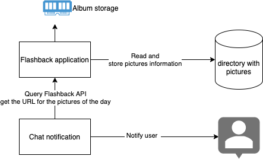
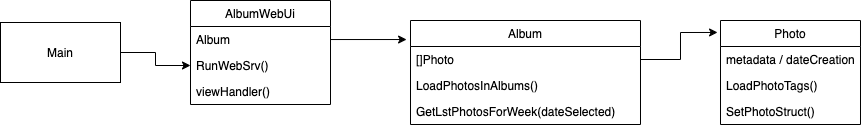
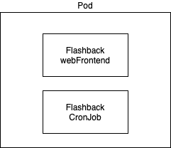

# Flashback

## Description 

The project goal is to have a system processing my pictures, extracting meta-data from the files (GPS location, labels, when the picture was taken, ...). Base on this information I would like to be able to process events. My first goal is to send, once a week, a chat message with a list of pictures taken at the same week number, but in previous years. The second step will be an android application, it's mostly to try android development. 

Flashback is/will be a web application wrote in GoLang and containerized.

## Architecture 

In the first iteration :

* pictures are accessible through the file system (keep in mind: find a mechanism to be able to process external sources)
* The album information will be store in memory (keep in mind: in the future, the storage could be externalised)
* Use google auth for authentication, this can be performed in the SSL front end if we use Nginx or Apache (Pictures *must* not be freely available on the net)
* Chat system will be RocketChat (In the future we will have to support more systems)
* Provide a web interface to visualize pictures of the day, with this method it will be easy to only send the URL link to the chat system.

For the first version, I do not expect support multi-user

Global information about the data flow : 

Code organisation :

Pod organisation :

## Code organization

* *Photo* struct (_photo.go_) : This is a single picture, the structure contains the raw metadata of the file and the most frequently used fields (labels, GPS, date).
* *Album* struct (_album.go_) : This is a collection of Photo, this struct can scan multiple directories for the *Photo*
* *AlbumWebUI* struct (_albums-webui.go_) : This is the web interface to query the *Album* 

## Dev environnement

To be able to run the application you need to have `exiftool` install and the binary must be set in your PATH

## A WeekEnd project

This project started as a weekend project, I wanted to practice GoLang and I wanted this application. I know amazon and google photo do that but do I want to give my pictures to them ?? Nooo. Like most of you, I take pictures but don't take the time to watch them again, because there are too many files :). As always, I expected to do more, but I'm happy with this start. 

You can view the development process I keep all Pull Requests, and I did not squash my commit. 

I tested few libraries to extract exit

* https://github.com/evanoberholster/imagemeta
* https://github.com/barasher/go-exiftool
* https://github.com/xiam/exif

I end up with: https://github.com/barasher/go-exiftool 
Why? Because it return all information I wanted, some other libs returned only the labels/tag and not the GPS location. I did not validate the performance. If I need to change the library in the future only the Photo struct will have to be replaced.

Unfortunately, I lost time with the interface conversion, and this explains why I extracted fields from the metadata variable. I know another mechanism could be create function like GetDate(), GetGPSLocation(), etc. I choose to not take this approach because I thought maybe keeping all the metadata for each picture will take too much memory. In my mind, if the memory becomes an issue, I could remove the metadata variable and keep only the requiered fields.

For the Album I changed my organization from [year][month] to [year][week]. My goal is to provide pictures of the current week taken in the past, it's simplified a lot the search operation.

It's the first time I created a web server in GoLang, It's working but I do not have enough time to complete the project. I enjoy my weekend ( played DnD, walk outside with the sun )  and did what I have to do, like groceries. 
	
I'm not a GoLang developer, but a Dev*Ops* guy. I hope the review was not boring.

## LICENCE

GPL v3 see [LICENSE](./LICENSE) for detail.
